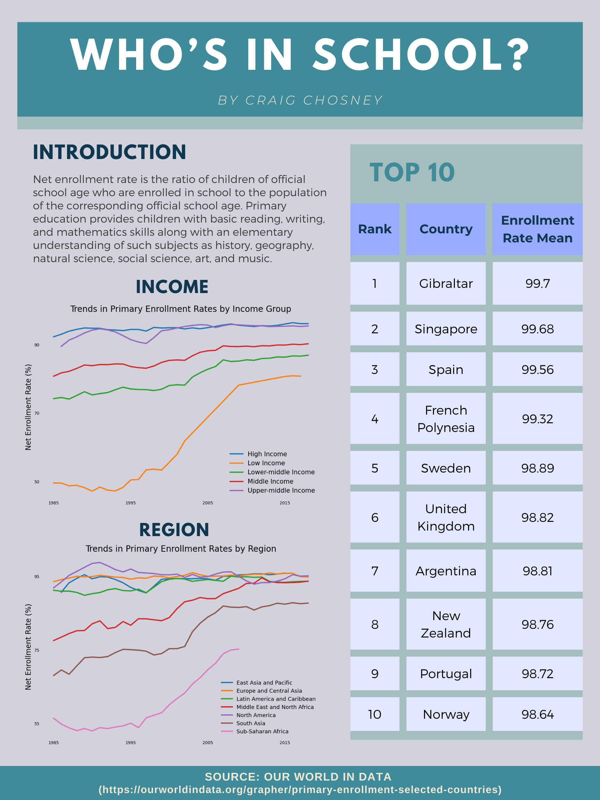
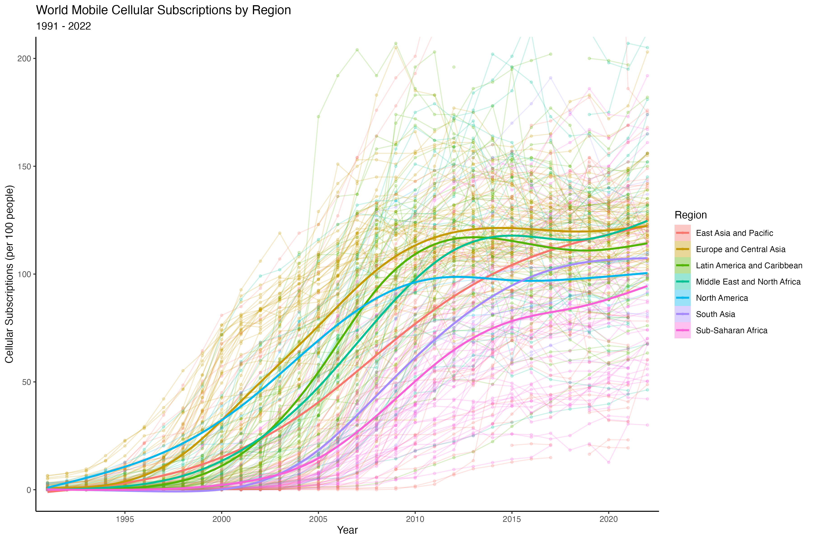
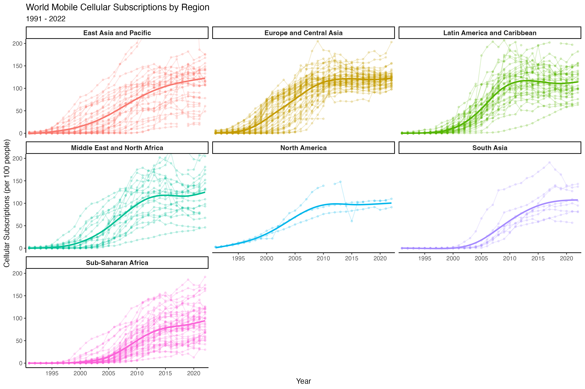
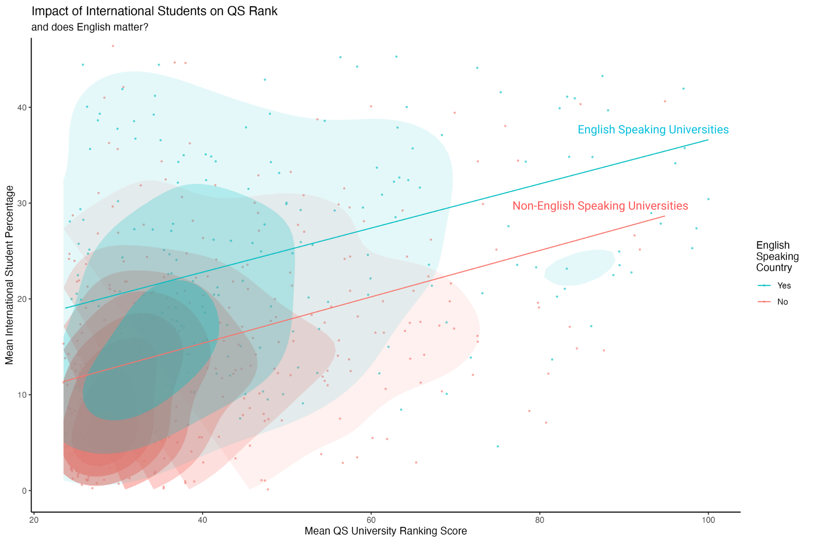
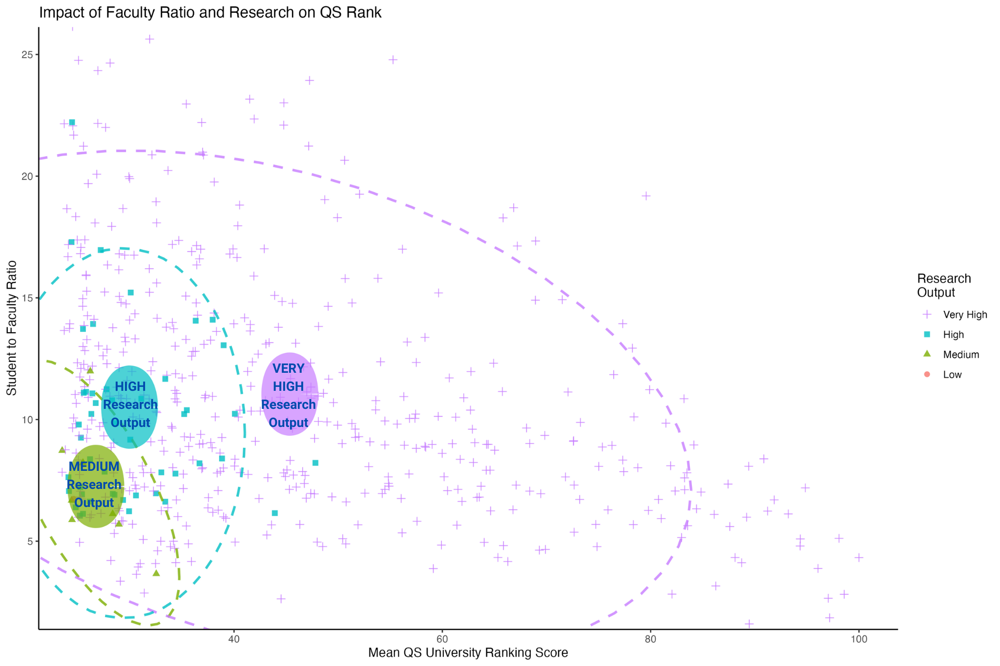
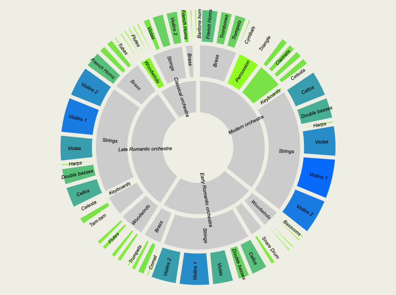
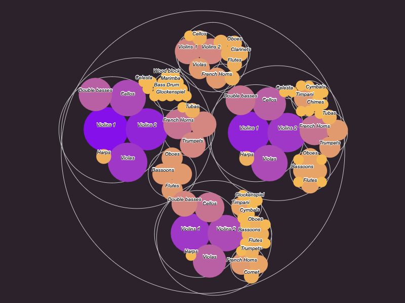

# Analytics Professional
### Email: ct.chosney@gmail.com
### [Resume PDF](assets/pdf/Chosney, Craig - Resume.pdf) | [LinkedIn](http://www.linkedin.com/in/ctchosney)
#### Data Visualization: Tableau, PowerBI, R Studio (ggplot2), Matplotlib
#### Programming: Python, SQL, R, STATA, C++
#### Modeling: Linear Regression, Logistic Regression, Machine Learning

---

## Academic Degrees		

&#9679; M.S. Quantitative Methods and Computer Science	| CUNY Graduate Center | _December 2024_
&#9679; A.A.S. Marketing and Communication | Parsons School of Design | _December 2007_
&#9679; B.A. Sociology/Anthropology and Geology | Denison University | _May 2005_

---

## Certificates

&#9679; Advanced Certificate in Data Science | CUNY Graduate Center | _May 2024_
&#9679; Google Data Analytics | Coursera | _August 2023_
&#9679; Bachelor's Certificate in Computer Science | NYU Tandon School of Engineering | _May 2022_

---

## Projects

### "Driving Towards Wage Equity With Machine Learning: Predicting Annual Wages by Job Title" | December 2024
[PDF](assets/pdf/CHOSNEY CAPSTONE - FINAL.pdf)

<iframe src="https://docs.google.com/presentation/d/e/2PACX-1vS13Tc0EB1HoKlGICuIeL5mAH93_WYey1Jgsw99aH9Ywhh875dbPpeytL9_JEmwbtVwLCFX2m9vrn7U/pubembed?start=false&loop=true&delayms=3000" frameborder="0" width="480" height="299" allowfullscreen="true" mozallowfullscreen="true" webkitallowfullscreen="true"></iframe>  

- Master's capstone project explores the differences in annual compensation between the internal data of a mid-size NYC cultural institution and national external market job valuation data to construct a machine learning model that models future compensation per job title for the mid-size cultural institution accounting for inflation, market rate wage changes, and tenure.

### "Big Data Privacy Preservation - A Survey" | December 2023
[PDF](assets/pdf/CHOSNEY - Big Data Privacy Preservation FINAL.pdf)

- Data privacy preservation methods are surveyed to introduce big data and privacy, delineate types of data privacy attacks and threats, establish the classic methods of data perturbation and anonymization, conceptualize the metrics used to evaluate these methods, and discuss future directions for the research of privacy preservation and its methods.

### "A Restaurant Queuing Model to Inform Staffing" | July 2023
[PDF](assets/pdf/Chosney Final Slide Deck.pdf) | [Jupyter Notebook](assets/pdf/Final Project - Chosney.ipynb)

- A Python simulation models customer flow at a restaurant in order to inform appropriate staffing decisions. I have adapted code for simulating customer flow in a business, and have used my decade of hospitality experience to inform the model's logisitics and probabilities. Having a stochastic model for simulating cover counts and customer flow allows us to optimize staffing for both employee and employer gain.

### "Gay Bar to Gei Bā, Shots to Shōchū: Comparing NYC and Tokyo’s Queer Nightlife Sites" | May 2023
[PDF](assets/pdf/CHOSNEY - GEY BAR TO GEI BA FINAL PAPER.pdf)

- Mapping and GIS data is used to compare sites of queer nightlife in NYC and Tokyo in terms of quantity, location, and density. Analysis of these comparisons reveal that differing historical influences and sociocultural attitudes towards homosexuality between New York City and Tokyo have resulted in different urban layouts of these city’s queer nightlife sites.

### "Measuring Factors for Museum Sector Income Inequality, 2016-2021" | May 2023
[PDF](assets/pdf/CHOSNEY - stats 2 final.pdf) | [STATA](assets/pdf/final_do_file.do)

- U.S. Census microdata is analyzed in STATA to determine which of the factors of age, sex, race, and managerial role contribute to income inequality for individuals employed in the museum and cultural institution job sector of the New York, Newark, and Jersey City Core Based Statistical Area.

### "Minority Representation in Museum Sector Employment, 2014-2020" | December 2022
[PDF](/assets/pdf/CHOSNEY---FINAL-PROJECT.pdf) | [R Markdown](/assets/pdf/CHOSNEY - FINAL PROJECT.Rmd)

- EEO-1 Component Collection data is analyzed using RStudio to answer the question of whether we have seen “progress” in terms of diversity, equity, and inclusion within the museum sector from the years 2014 to 2020 at the site of the NYC Core Based Statistical Area and how this “progress” compares to any at the national level.
  

---

## Visualizations

### &#9679; Canva/Python
### ["Who's In School?"](assets/img/DV HW4_FINAL.png) 

Source: [Our World In Data](https://ourworldindata.org/grapher/primary-enrollment-selected-countries)

### &#9679; R Studio
### ["World Mobile Cellular Subscriptions by Region"](assets/img/cell_plot.png) 

Source: [The World Bank](https://data.worldbank.org/indicator/IT.CEL.SETS.P2)

### ["World Mobile Cellular Subscriptions Faceted by Region"](assets/img/cell_plot_facet.png) 

Source: [The World Bank](https://data.worldbank.org/indicator/IT.CEL.SETS.P2)

### ["International Students and QS Rank:  Does English Matter?"](assets/img/chosney_dviz_2_1_FINAL.png) 

Source: [QS World University Rankings 2017–2022](https://www.kaggle.com/padhmam/qs-world-university-rankings-2017-2022)

### ["Impact of Faculty Ratio and Research on QS Rank"](assets/img/chosney_dviz_2_2_FINAL.png) 

Source: [QS World University Rankings 2017–2022](https://www.kaggle.com/padhmam/qs-world-university-rankings-2017-2022)

### &#9679; RAWGraphs
### ["Visualizing the Western Orchestra - Light"](assets/img/dviz_hw3_revise.png) 

### ["Visualizing the Western Orchestra - Dark"](assets/img/Chosney_DVHW_3_dark.png) 

### &#9679; Flourish

 

---

## Work Experience

**Data Analytics Consultant - Mathchops**\
_January 2025 - Current_
- Designed and optimized SQL queries to analyze student performance trends, providing insights for targeted tutoring strategies and achieving a 25% increase in student proficiency.
- Developed SQL-driven dashboards to track user progression, identifying that 35% of standard signups converted into high-value tutors, informing data-driven growth strategies.

**Data Analytics Consultant
 - Confidential Cultural Institutions**\
_September 2022 - December 2024_
- Collaborated with HR leaders to streamline EEO reporting and HRIS analytics, improving data accuracy and compliance.
- Conducted predictive analytics using Python and R to identify compensation trends, leading to actionable insights for strategic planning.

**Business Operations Analyst & Team Lead - Freemans / Alley Management**\
_August 2012 - December 2024_
- Analyzed sales, labor, and customer flow data to identify operational inefficiencies and inform decisions that improved cost control and staffing alignment.
- Managed and coached a 10+ person team, applying data-driven insights to optimize workflows,
improve service consistency, and meet performance targets.
